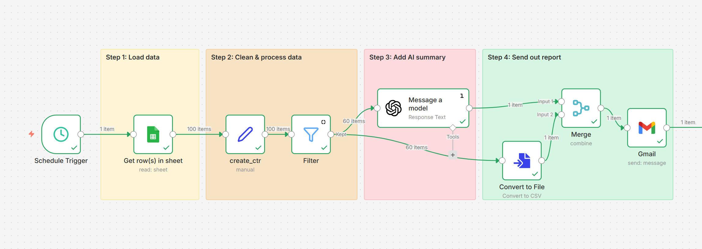

# 🚀 Automated Ad Campaign Performance & AI Reporting Pipeline
An "Agentic AI" workflow built with n8n that automates the end-to-end process of monitoring ad performance, filtering low-performing assets, and generating strategic summaries using LLMs.

---

  
   
  <b>Figure 1:</b> <i>Automated Ad Performance & AI Reporting Pipeline Architecture.</i>

---

# 📝 Overview
- Manual campaign reporting is often a bottleneck for marketing and strategy teams.

- This project demonstrates a self-operating pipeline that bridges the gap between raw data and executive decision-making.

- By combining logic-based filtering with GPT-4, the system ensures that "red flag" metrics (like low CTR) are immediately analyzed and reported with actionable recommendations.

---

# 🛠️ Tech Stack
- Orchestration: n8n

- Artificial Intelligence: OpenAI (GPT-4.1-mini)

- Data Source: Google Sheets API

- Communication: Gmail API

- Processing: JavaScript (for custom metric expressions)

---

# ⚙️ How It Works
The workflow follows a 4-step modular architecture:

- Data Extraction: A scheduled trigger fetches weekly campaign data (impressions, clicks, etc.) from a centralized Google Sheet.

- Transformation & Logic: * Calculates the Click-Through Rate (CTR) using a custom expression node.

- Applies a Strict Filter to isolate campaigns with a CTR below 3%.

- Agentic AI Analysis: The filtered data is passed to a GPT-4 model with a specific persona prompt. The model analyzes patterns and generates a structured HTML report.

- Automated Reporting: The system merges the AI-generated insights with the raw data file and sends a formatted briefing to the Account Manager via Gmail.

---

# 🚀 Business Value
- Efficiency: Reduces weekly reporting overhead by 100% through autonomous execution.

- Speed to Insight: Automatically flags underperforming assets, allowing for real-time budget reallocation.

- Strategic Quality: Leveraging LLMs ensures that reports are not just data dumps but include professional, context-aware recommendations.

---

# 📖 How to Use
- Import: Download the .json file from this repo and import it into your n8n instance.

- Credentials: Set up your own OAuth2 credentials for Google Sheets, Gmail, and your prefered API Key.

- Sheet Configuration: Update the Get row(s) in sheet node with your specific Google Sheet ID.

- Activate: Toggle the Schedule Trigger to start the weekly automated runs.

---
